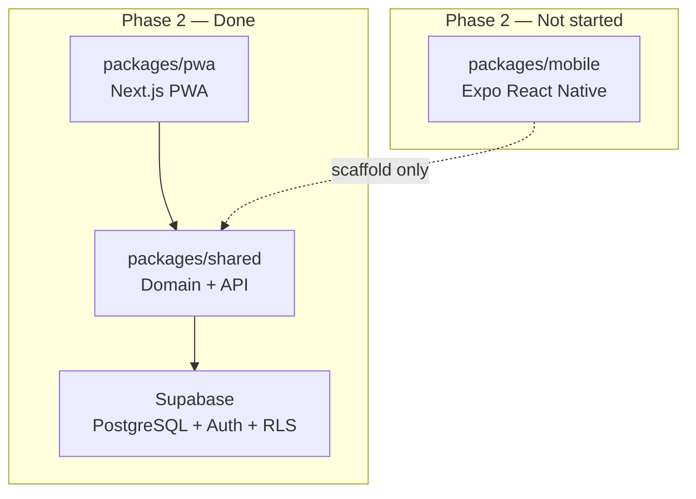

# Phase 2 — Core MVP Implementation

> Current state of the Aradhya Seed Store monorepo after Phase 2.  
> Business context: [README.md](./README.md) · Schema: [supabase/README.md](./supabase/README.md)

**Status:** Phase 2 complete for **PWA (web)**. **Mobile** remains Phase 1 scaffold.

---

## Summary

| Layer | Status | Notes |
|-------|--------|-------|
| Supabase schema | Done | `001_initial_schema.sql` + `002_rpc_grants_and_seed.sql` |
| `@aradhya/shared` | Done | Types, API, auth helpers, invoice math |
| `@aradhya/pwa` | **Functional** | Auth, stock CRUD, customers, sales, dashboard |
| `@aradhya/mobile` | Placeholder | UI shell only; no data wiring or auth |



---

## Phase 2 Goals (from README)

| Goal | PWA | Mobile |
|------|-----|--------|
| Product/stock CRUD | Yes | No |
| Sale creation with line items, total/received/balance | Yes | No |
| Customer list with outstanding balance | Yes | No |
| Auto stock deduction on sale | Yes (via RPC) | No |
| Owner login (Supabase Auth) | Yes | No |

---

## Backend & Database

### Migrations

| File | Purpose |
|------|---------|
| [`supabase/migrations/001_initial_schema.sql`](./supabase/migrations/001_initial_schema.sql) | Tables, RLS, `create_sale_with_items` RPC |
| [`supabase/migrations/002_rpc_grants_and_seed.sql`](./supabase/migrations/002_rpc_grants_and_seed.sql) | `GRANT EXECUTE` on RPC + seed data |

### Tables

- `products` — stock register (name, HSN, unit, qty, MFG/exp dates)
- `customers` — name, address, phone
- `sales` — invoice header (total, received, balance)
- `sale_items` — line items per sale
- `stock_movements` — audit trail (auto-written on sale)

### Security

- RLS enabled on all tables
- Only `authenticated` users can read/write
- Anon key is safe in clients when RLS is on
- Sale RPC runs as `SECURITY DEFINER` and rejects negative stock

### Seed data (`002`)

Run once in Supabase SQL Editor:

- **8 products** — wheat, paddy, mustard, maize, cotton, vegetable mix, neem oil, NPK fertilizer
- **5 customers** — Chhatter-area names and addresses

Seed is idempotent: inserts only when tables are empty.

### Manual setup (required)

1. Create Supabase project and run both migrations
2. Create store owner in **Authentication → Users** (email/password)
3. Set env vars (see [Environment](#environment))

---

## Shared Layer (`@aradhya/shared`)

Single source of truth for domain logic. Both clients import from here.

### Types

`Product`, `Customer`, `CustomerWithBalance`, `Sale`, `SaleItem`, `CreateSaleInput`, `StockMovement`, `STORE_INFO`

### API — Products

| Function | Description |
|----------|-------------|
| `getProducts` | List all products |
| `getProductById` | Single product by ID |
| `createProduct` | Insert product |
| `updateProduct` | Update product |
| `deleteProduct` | Delete product (fails if referenced by sales) |

### API — Customers

| Function | Description |
|----------|-------------|
| `getCustomers` | List all customers |
| `getCustomersWithBalance` | Customers + summed `balance_amount` from sales |
| `createCustomer` | Insert customer |
| `updateCustomer` | Update customer |
| `deleteCustomer` | Delete customer (fails if referenced by sales) |

### API — Sales

| Function | Description |
|----------|-------------|
| `getSales` | List sale headers (newest first) |
| `createSale` | Atomic sale via `create_sale_with_items` RPC |

### API — Auth

| Function | Description |
|----------|-------------|
| `signInWithPassword` | Email/password login |
| `signOut` | End session |
| `getSession` | Current session or null |

### Utils

`calcLineAmount`, `calcTotalAmount`, `calcBalance`, `formatINR`, `formatUnit`, `isValidHsnCode`, `isValidUnit`, `wouldStockGoNegative`

---

## Web App (`@aradhya/pwa`)

**Stack:** Next.js 15 App Router · Tailwind CSS v4 · `@aradhya/shared` · Supabase JS

**Dev server:** `pnpm --filter @aradhya/pwa dev` → http://localhost:3000

### Route map

| Route | Screen | Status |
|-------|--------|--------|
| `/login` | Owner login | Functional |
| `/` | Dashboard | Functional — live stats + quick links |
| `/stock` | Stock register | Functional — list, add, edit |
| `/customers` | Customers | Functional — list with balance, add, edit |
| `/sales` | New sale | Functional — line items, totals, save |

### Auth flow

- `AuthProvider` wraps the app; unauthenticated users redirect to `/login`
- Login uses `signInWithPassword` with Supabase session in browser
- NavBar shows Logout on all protected pages
- No `@supabase/ssr` — client-side session only (single-owner MVP)

**Key files:**

- [`packages/pwa/src/components/AuthProvider.tsx`](./packages/pwa/src/components/AuthProvider.tsx)
- [`packages/pwa/src/app/login/page.tsx`](./packages/pwa/src/app/login/page.tsx)
- [`packages/pwa/src/lib/supabase.ts`](./packages/pwa/src/lib/supabase.ts)

### Dashboard (`/`)

- Product count
- Total outstanding balance (sum across customers)
- Today's sales count
- Quick links to Stock, Sales, Customers

### Stock (`/stock`)

- Table: Sr., Product, HSN, Qty, Unit, MFG Date, Exp Date, Edit
- Inline add/edit form: name, HSN, unit (`kg`/`ltr`), stock qty, MFG/exp dates
- Client-side HSN and unit validation
- Data via `getProducts`, `createProduct`, `updateProduct`

### Customers (`/customers`)

- Table: Name, Address, Phone, Outstanding Balance, Edit
- Add/edit form for name, address, phone
- Outstanding balance from `getCustomersWithBalance` (aggregates sale balances)

### Sales (`/sales`)

- Customer dropdown + sale date
- Dynamic line items: product select (auto-fills HSN), qty, rate, live amount
- Totals panel: total, received (editable), balance (computed)
- Pre-submit stock check via `wouldStockGoNegative`
- Save calls `createSale` → RPC deducts stock atomically
- Success/error messages; product list refreshes after save

### Not in PWA yet (Phase 3)

- Invoice PDF / print
- Expiry and low-stock alerts
- Reports by date range
- Delete UI for products/customers (API exists, no UI button)

---

## Mobile App (`@aradhya/mobile`)

**Stack:** Expo SDK 53 · Expo Router · React Native · `@aradhya/shared`

**Status:** Phase 1 scaffold — mirrors PWA layout but **no Supabase wiring**.

### Route map

| Route | Screen | Status |
|-------|--------|--------|
| `/` | Dashboard | Placeholder — quick links + "Scaffold Status" banner |
| `/stock` | Stock register | Placeholder — empty table, non-functional Add button |
| `/sales` | New sale | Placeholder — hardcoded ₹0.00 totals |
| `/customers` | Customers | Placeholder — empty table, non-functional Add button |

### What exists

- Expo Router file-based navigation
- `AppHeader` component (mirrors PWA NavBar)
- `getSupabaseClient()` factory in [`packages/mobile/src/lib/supabase.ts`](./packages/mobile/src/lib/supabase.ts) — **unused**
- Green agricultural theme via StyleSheet

### What is missing

- Login / auth gate
- Data fetching from `@aradhya/shared` API
- CRUD forms for stock and customers
- Sale creation form
- `EXPO_PUBLIC_SUPABASE_*` env file (see below)
- Live dashboard stats

### To make mobile functional

Reuse the same patterns as PWA:

1. Add `packages/mobile/.env` with `EXPO_PUBLIC_SUPABASE_URL` and `EXPO_PUBLIC_SUPABASE_ANON_KEY`
2. Add auth screen + session provider
3. Wire each screen to shared API functions
4. Adapt forms to React Native components

Shared layer is ready — mobile work is UI-only.

---

## Environment

| Variable | Package | Required for Phase 2 |
|----------|---------|----------------------|
| `NEXT_PUBLIC_SUPABASE_URL` | PWA | Yes |
| `NEXT_PUBLIC_SUPABASE_ANON_KEY` | PWA | Yes |
| `EXPO_PUBLIC_SUPABASE_URL` | Mobile | No (not wired yet) |
| `EXPO_PUBLIC_SUPABASE_ANON_KEY` | Mobile | No (not wired yet) |

PWA env file: `packages/pwa/.env.local`  
Mobile env file: `packages/mobile/.env` (not created yet)

---

## Verification Checklist

Use this to confirm Phase 2 is working end-to-end on the **web app**:

- [ ] Migrations `001` and `002` applied in Supabase SQL Editor
- [ ] Owner account created in Supabase Auth
- [ ] `packages/pwa/.env.local` has valid Supabase URL + anon key
- [ ] `pnpm --filter @aradhya/pwa dev` starts without errors
- [ ] Unauthenticated visit to `/` redirects to `/login`
- [ ] Login succeeds with owner credentials
- [ ] Stock page shows seed products (8 rows after migration 002)
- [ ] Customers page shows seed customers with ₹0.00 balance
- [ ] Add product and customer → appear in lists
- [ ] Create sale with partial payment → customer balance updates, stock decreases
- [ ] Sale with qty > stock → rejected with error
- [ ] Logout → redirected to login, data inaccessible

---

## Commands

```bash
# Install dependencies
pnpm install

# Run PWA only
pnpm --filter @aradhya/pwa dev

# Run mobile scaffold (no data yet)
pnpm --filter @aradhya/mobile start

# Type-check all packages
pnpm typecheck

# Rebuild shared after API changes
pnpm --filter @aradhya/shared build
```

---

## Phase 3 — Next (not started)

From [README.md](./README.md):

- Invoice PDF + print (PWA) / share sheet (mobile)
- Expiry and low-stock alerts
- Reports by date range
- Wire mobile app to shared API (extend Phase 2 to Android)

---

## File Index (Phase 2 changes)

### New / updated — database

- `supabase/migrations/002_rpc_grants_and_seed.sql`

### New / updated — shared

- `packages/shared/src/api/auth.ts`
- `packages/shared/src/api/index.ts` (balance, deletes)
- `packages/shared/src/types/index.ts` (`CustomerWithBalance`)
- `packages/shared/src/supabase/database.ts` (Relationships for supabase-js 2.x)

### New / updated — PWA

- `packages/pwa/src/app/login/page.tsx`
- `packages/pwa/src/components/AuthProvider.tsx`
- `packages/pwa/src/components/NavBar.tsx` (logout, active link)
- `packages/pwa/src/app/page.tsx` (dashboard stats)
- `packages/pwa/src/app/stock/page.tsx`
- `packages/pwa/src/app/customers/page.tsx`
- `packages/pwa/src/app/sales/page.tsx`
- `packages/pwa/src/app/layout.tsx` (AuthProvider wrapper)

### Unchanged — mobile (still scaffold)

- `packages/mobile/app/index.tsx`
- `packages/mobile/app/stock/index.tsx`
- `packages/mobile/app/sales/index.tsx`
- `packages/mobile/app/customers/index.tsx`

---

*Aradhya Seed Store · Chhatter, India · Mob: 70180 63629*
