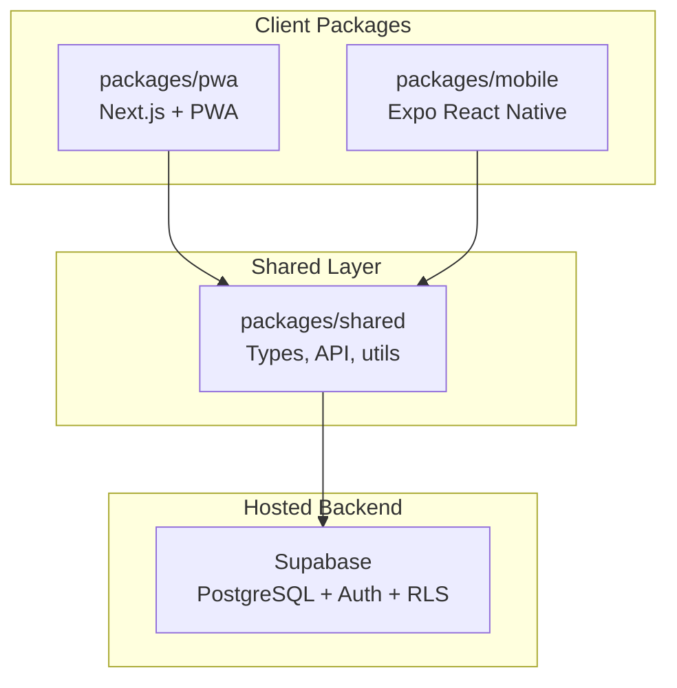

# Aradhya Seed Store — Monorepo

> **Context engineering document.** Read this first before changing any package.  
> Business requirements live in [PROJECT_PLAN.md](./PROJECT_PLAN.md).

Digitizes the paper **stock register** and **customer billing register** for **Aradhya Seed Store**, Chhatter, India (Mob: 70180 63629).

---

## Architecture



Both clients are **thin UI layers**. All domain types, Supabase access, and business calculations live in `@aradhya/shared`.

---

## Monorepo Map

| Path | Package | Role |
|------|---------|------|
| [`packages/shared`](./packages/shared) | `@aradhya/shared` | Domain types, Supabase client, API wrappers, pure utils |
| [`packages/pwa`](./packages/pwa) | `@aradhya/pwa` | Next.js web app + installable PWA (shop counter / desktop) |
| [`packages/mobile`](./packages/mobile) | `@aradhya/mobile` | Expo React Native app (Android field use) |
| [`supabase/`](./supabase) | — | SQL migrations, schema docs (not an npm package) |

### Dependency Rules

```
@aradhya/pwa   ──► @aradhya/shared
@aradhya/mobile ──► @aradhya/shared

@aradhya/pwa   ✕ @aradhya/mobile   (never cross-import clients)
```

- Put **UI** in `pwa` or `mobile` only.
- Put **business logic, types, API calls** in `shared` only.
- Do not duplicate invoice math or HSN validation across packages.

---

## For Android / React Native Engineers

If you've built multi-module Android or RN apps, this mapping should feel familiar:

| Android / RN concept | This repo |
|---------------------|-----------|
| Gradle multi-module root | Root `package.json` + `pnpm-workspace.yaml` + `turbo.json` |
| `:core` / `:domain` module | `packages/shared` |
| `:app` (Android) | `packages/mobile` |
| Web admin panel Activity | `packages/pwa` Next.js pages |
| `Activity` / `Fragment` | PWA: `app/**/page.tsx` · Mobile: `app/**/*.tsx` (Expo Router) |
| Jetpack Navigation / React Navigation | Expo Router file-based routes; Next.js App Router |
| Retrofit / Apollo client | Supabase JS client in `@aradhya/shared` |
| Room / SQLite | Supabase PostgreSQL (remote, relational) |
| Firebase Auth | Supabase Auth (email/password for store owner) |
| `implementation(project(":shared"))` | `"@aradhya/shared": "workspace:*"` in package.json |
| Gradle task graph | Turborepo pipeline (`build`, `dev`, `typecheck`) |
| `build.gradle` dependencies | `package.json` dependencies per package |
| ProGuard / R8 | TypeScript compiler + tree-shaking at bundler level |
| APK / AAB release | Expo EAS Build → `.apk` |
| Play Store listing | Optional later (₹1,750 one-time fee) |

### Why separate PWA and Mobile (not one React Native Web codebase)?

- **PWA (Next.js):** Optimized for desktop/tablet billing, printing invoices, keyboard-heavy data entry, installable from browser without Play Store.
- **Mobile (Expo RN):** Native Android UX you already know — gestures, share sheet, camera (future), offline patterns with AsyncStorage.
- **Shared layer** prevents duplicating the hard part (domain + API).

---

## Technology Stack

| Layer | Choice | Why |
|-------|--------|-----|
| Monorepo | pnpm workspaces + Turborepo | Strict deps, fast installs, parallel dev tasks |
| Language | TypeScript (strict) | Shared types across web and mobile |
| Web | Next.js 15 App Router + Tailwind | SSR-capable, Vercel deploy, file-based routing |
| PWA | Web manifest + `@serwist/next` | Installable on Android/desktop, offline-ready path |
| Mobile | Expo SDK 53 + Expo Router | Matches RN experience; no manual Gradle for MVP |
| Backend | Supabase | Free PostgreSQL + Auth + RLS; relational fit for invoices |
| Deploy | Vercel (PWA) · EAS (mobile) · Supabase (DB) | All have free tiers |

---

## Domain Invariants

Agents and engineers **must not violate** these rules:

1. **Units** are only `kg` or `ltr` — no other unit strings.
2. **Line amount** = `quantity × rate` (rounded to 2 decimal places for currency).
3. **Balance** = `total_amount − received_amount` (can be > 0 for credit sales).
4. **Stock** must not go negative when a sale is saved — reject or block the transaction.
5. **HSN code** is required on every product and copied to each sale line item.
6. **Sale is atomic** — insert sale header + line items + stock deduction in one DB transaction.
7. Store details on invoices: **ARADHYA SEED STORE**, Chhatter, Mob: 70180 63629.

Full field spec: [PROJECT_PLAN.md §2](./PROJECT_PLAN.md#2-data-fields-from-handwritten-layout).

---

## Environment Variables

Copy [`.env.example`](./.env.example) to package-local env files. **Never commit `.env`.**

| Variable | Used by | Purpose |
|----------|---------|---------|
| `NEXT_PUBLIC_SUPABASE_URL` | PWA | Supabase project URL (client-side) |
| `NEXT_PUBLIC_SUPABASE_ANON_KEY` | PWA | Supabase anon key (client-side, RLS-protected) |
| `EXPO_PUBLIC_SUPABASE_URL` | Mobile | Same URL, Expo public prefix |
| `EXPO_PUBLIC_SUPABASE_ANON_KEY` | Mobile | Same anon key, Expo public prefix |

Supabase **anon key is safe in client apps** when Row Level Security (RLS) is enabled. See [`supabase/README.md`](./supabase/README.md).

---

## Development Commands

Prerequisites: **Node.js 20+**, **pnpm 10+** (`corepack enable && corepack prepare pnpm@10.12.1 --activate`).

```bash
# Install all workspace dependencies
pnpm install

# Run all dev servers (PWA + mobile) in parallel
pnpm dev

# Run a single package
pnpm --filter @aradhya/pwa dev
pnpm --filter @aradhya/mobile start

# Type-check all packages
pnpm typecheck

# Build all packages
pnpm build
```

### First-time setup

1. Create a free [Supabase](https://supabase.com) project.
2. Run migration from [`supabase/migrations/001_initial_schema.sql`](./supabase/migrations/001_initial_schema.sql) (see supabase README).
3. Copy env vars into `packages/pwa/.env.local` and `packages/mobile/.env`.
4. `pnpm install && pnpm typecheck`

---

## Deployment Matrix

| Artifact | Tool | Free output |
|----------|------|-------------|
| PWA | [Vercel](https://vercel.com) — set root dir to `packages/pwa` | `*.vercel.app` |
| Mobile APK | [Expo EAS Build](https://docs.expo.dev/build/introduction/) | Sideload `.apk` |
| Database | Supabase dashboard | `*.supabase.co` |
| Custom domain | Optional (~₹500–800/yr) | Skip for MVP |

---

## Implementation Phases

### Phase 1 — Scaffold (current)

Monorepo structure, READMEs, placeholder screens, shared types, Supabase migration SQL.

### Phase 2 — Core MVP

- Product/stock CRUD
- Sale creation with line items, total/received/balance
- Customer list with outstanding balance
- Auto stock deduction on sale
- Owner login (Supabase Auth)

### Phase 3 — Daily use

- Invoice PDF + print (PWA) / share sheet (mobile)
- Expiry and low-stock alerts
- Reports by date range

---

## Conventions

- Package names: `@aradhya/*`
- TypeScript `strict: true` in all packages
- No default exports in `shared` — use named exports from `src/index.ts`
- Commits: conventional style preferred (`feat(pwa):`, `fix(shared):`)
- AI agents: read this README + relevant package README before editing

---

## Package READMEs

| Doc | Contents |
|-----|----------|
| [`packages/shared/README.md`](./packages/shared/README.md) | Types, API contract, domain utils |
| [`packages/pwa/README.md`](./packages/pwa/README.md) | Next.js dev, PWA config, Vercel deploy |
| [`packages/mobile/README.md`](./packages/mobile/README.md) | Expo dev, Metro monorepo config, EAS build |
| [`supabase/README.md`](./supabase/README.md) | Schema, migrations, RLS policies |

---

*Aradhya Seed Store · Chhatter, India · Mob: 70180 63629*
